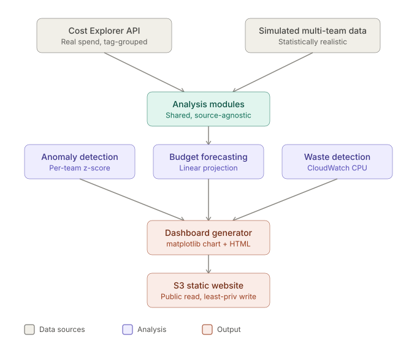

# FinOps Showback

Automated multi-team AWS cost attribution, anomaly detection, forecasting, and waste identification, built to answer the question most companies struggle with: which team is actually spending our cloud budget, and is any of it being wasted.

Status: Core functionality complete and validated against real AWS infrastructure.

## Architecture

## What this does

Six capabilities, each addressing a real cost-governance problem:

1. **Cost attribution** - queries AWS Cost Explorer directly, broken down by team via cost allocation tags
2. **Multi-team simulation** - generates realistic, statistically varied cost data for multiple teams, used to build and validate the analysis logic without waiting on real multi-team spend to accumulate
3. **Anomaly detection** - flags unusual spend using a per-team z-score against each team's own historical baseline, rather than a single fixed threshold across all teams
4. **Cost dashboard** - a static, auto-generated chart showing daily spend by team, hosted on S3
5. **Budget forecasting** - linear projection of month-end spend based on recent daily average, compared against each team's budget
6. **Waste detection** - flags EC2 instances with sustained low CPU utilization via CloudWatch, the classic "forgotten instance" pattern

## A note on data

Cost attribution (feature 1) and waste detection (feature 6) query real AWS data from a live account. Anomaly detection, forecasting, and the dashboard were built and validated using realistic simulated multi-team data (see `src/simulate_data.py`), since the underlying AWS account only has a single tagged team's worth of real spend history. The simulation and analysis logic are fully decoupled, so swapping in live multi-team data requires no changes to the analysis code itself.

## Tech stack

- Python, boto3 (AWS Cost Explorer, EC2, CloudWatch, S3 APIs)
- matplotlib (dashboard chart generation)
- Terraform (S3 static website hosting, least-privilege IAM)
- AWS Cost Explorer, CloudWatch, S3

## Security

A dedicated, least-privilege IAM identity (`finops-readonly`) was created specifically for this project's runtime needs, scoped to only the exact API actions the code calls: Cost Explorer read, EC2 describe, CloudWatch metric reads, and S3 write restricted to a single bucket. This was deliberately built after the core logic was complete, so the policy could be scoped to the code's actual, observed needs rather than guessed in advance.

## Live dashboard

The cost dashboard is hosted as a static website on S3: [view example chart](docs/example_dashboard_chart.png)

## Debugging log

A running log of real issues encountered during development, including AWS cost allocation tag activation behavior, recurring WSL clock drift, and their fixes: [Debugging log](docs/debugging-log.md)

## Repository structure

- `src/` - Python application code for each feature
- `terraform/` - infrastructure as code for S3 dashboard hosting and least-privilege IAM
- `docs/` - debugging log and supporting documentation
- `dashboard/` - locally generated dashboard output (gitignored, regenerated by running `src/generate_dashboard.py`)

## License

MIT
